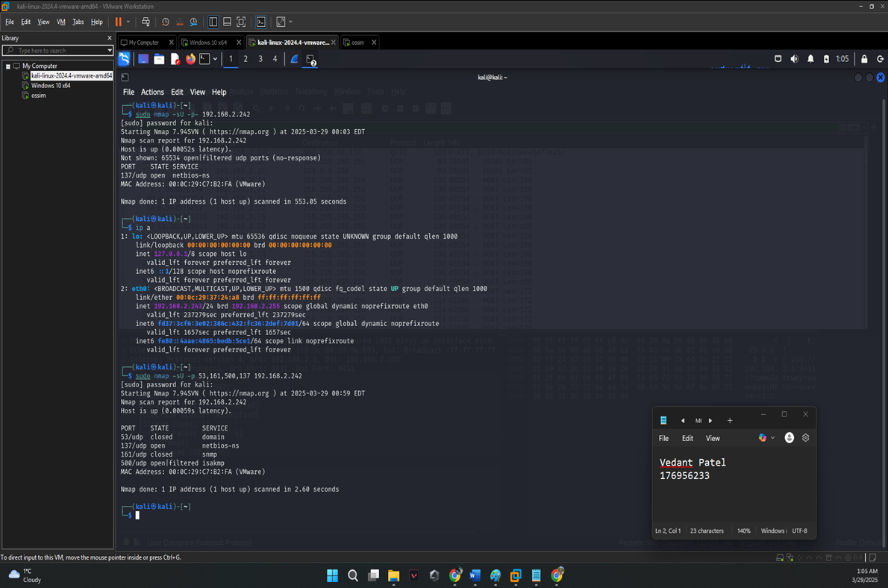
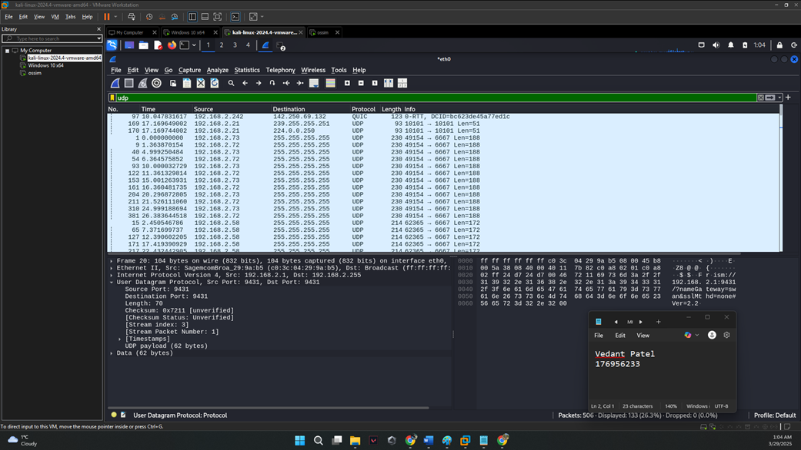
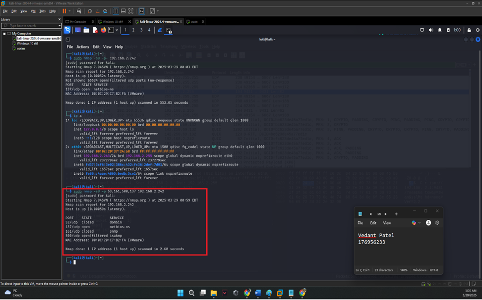
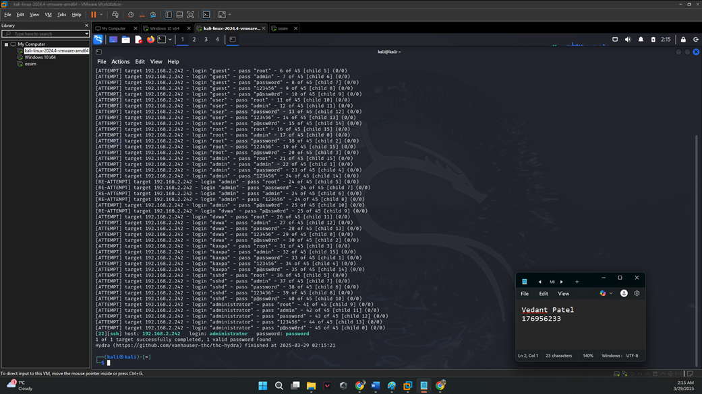

# Network Security Analysis: UDP Port Scanning, Traffic Analysis, and SSH Brute Force Simulation

## Overview

This project simulates attacker reconnaissance and credential attack techniques in a controlled lab environment, then analyzes the resulting network traffic from a defender's perspective. Using Nmap, Wireshark, and Hydra, the lab covers full UDP port scanning, packet-level traffic analysis, SSH brute-force simulation, and production of an incident-style report with prioritized defensive recommendations.

---

## Objective

- Perform a full UDP port scan to identify exposed services and map attack surface
- Capture and analyze network traffic in Wireshark to understand scan and attack behavior at the packet level
- Simulate an SSH brute-force attack to demonstrate credential risk on exposed services
- Produce incident-style documentation with security impact assessment and prioritized mitigations

---

## Tools Used

- Nmap (network scanning and service enumeration)
- Wireshark (packet capture and traffic analysis)
- Hydra (brute-force simulation)
- Kali Linux
- Virtualized private lab network

---

## Environment

All activity was conducted in an isolated virtualized environment using private test systems. No external or production systems were targeted.

---

## Investigation Walkthrough

### Step 1 — Full UDP Port Scan (Nmap)
Executed a full UDP scan across all 65,535 ports on the lab target to identify exposed services and establish the attack surface.

**Command used:**
```bash
nmap -sU -p- <target-ip>
```

**Key findings:**
- Multiple UDP ports identified as open or open|filtered
- Notable services exposed: DNS (53), SNMP (161), NetBIOS (137)
- SNMP exposure assessed as high risk — default community strings can allow unauthenticated information disclosure
- Full port scan surface documented with service-to-risk mapping

**Defender takeaway:** SNMP and NetBIOS exposure on a host accessible from the network perimeter significantly increases attack surface. These services should be disabled if not required, or restricted by firewall ACL.

### Step 2 — Packet-Level Traffic Analysis (Wireshark)
Captured UDP traffic during the Nmap scan to analyze behavior at the packet level.

**Key observations:**
- Open UDP ports: no response returned (expected — UDP is connectionless)
- Closed UDP ports: ICMP Port Unreachable (Type 3, Code 3) messages returned by target, confirming port is closed
- This behavioral difference allows analysts to distinguish open vs. closed UDP ports during traffic review
- High volume of outbound UDP probes during scan period — a pattern that would trigger anomaly-based detection in a real SOC environment

**SOC application:** A detection rule alerting on ICMP Port Unreachable bursts or sequential UDP probes from a single source IP within a short window would catch this reconnaissance pattern in production.

### Step 3 — Service Enumeration
Ran service version detection against identified open ports to gather detailed service information.

**Command used:**
```bash
nmap -sV -p <open-ports> <target-ip>
```

SSH (port 22) confirmed as running and accessible. Service version identified — relevant for vulnerability matching against known CVEs.

### Step 4 — SSH Brute Force Simulation (Hydra)
Simulated a credential brute-force attack against the exposed SSH service to demonstrate the risk of weak password policies.

**Command used:**
```bash
hydra -l <username> -P <wordlist> ssh://<target-ip>
```

**Key findings:**
- Weak credentials successfully recovered within the attack window
- No account lockout was triggered — service allowed unlimited authentication attempts
- No rate limiting or connection throttling was in place
- Demonstrated how quickly automated tools can recover weak passwords against unprotected services

**Defender takeaway:** Without account lockout or rate limiting, an attacker with network access to port 22 can systematically test credential lists at machine speed. A single weak password on a privileged account is sufficient for full system compromise.

### Step 5 — Security Impact Assessment

| Risk Area | Finding | Severity |
|---|---|---|
| UDP Attack Surface | Multiple services exposed including SNMP | High |
| SSH Exposure | Port 22 accessible, no lockout policy | High |
| Credential Weakness | Weak password recovered via brute force | Critical |
| Network Visibility | No detection capability observed during scan | Medium |
| Monitoring Gap | No rate limiting or anomaly alerting in place | Medium |

### Step 6 — Incident-Style Report and Mitigations

**Prioritized recommendations:**

1. **Disable or restrict SNMP** — Change default community strings immediately. Restrict SNMP access to management network only via ACL. Disable entirely if not required.

2. **Enforce SSH hardening** — Disable password-based SSH authentication entirely and migrate to key-based authentication. Key-based auth eliminates the brute-force credential vector regardless of password strength — fundamentally more secure than MFA for SSH specifically since there is no secret to guess.

3. **Implement account lockout and rate limiting** — Configure SSH MaxAuthTries 3 and integrate fail2ban to ban IPs after repeated failures. Recommended threshold: 5 failed attempts triggers a 10-minute IP ban.

4. **Restrict port 22 access** — Limit SSH access to known management IPs via firewall ACL. Port 22 should not be exposed to the general network.

5. **Deploy network anomaly detection** — Alert on sequential UDP probes or high-volume ICMP Port Unreachable responses from a single source. Example threshold: >500 ICMP unreachable responses from one source in 60 seconds.

6. **Disable unused UDP services** — Audit all exposed UDP services. Disable NetBIOS over TCP/IP if not required.

---

## MITRE ATT&CK Mapping

| Technique | ID | Description |
|---|---|---|
| Network Service Discovery | T1046 | Full UDP port scan to identify exposed services |
| Brute Force: Password Guessing | T1110.001 | Hydra SSH credential brute force |
| Exploit Public-Facing Application | T1190 | SSH exposed to network with no lockout |
| Network Sniffing | T1040 | Wireshark packet capture to analyze traffic behavior |

---

## Key Findings Summary

| Finding | Detail |
|---|---|
| Ports Scanned | All 65,535 UDP ports |
| High-Risk Services Found | SNMP (161), NetBIOS (137), SSH (22) |
| Brute Force Result | Credentials successfully recovered |
| Lockout Policy | None — unlimited attempts allowed |
| MITRE Techniques Demonstrated | T1046, T1110.001, T1190, T1040 |
| Overall Risk Rating | High |

---

## Screenshots

### UDP Scan Output (Nmap)


### Wireshark UDP Traffic Capture


### Service Enumeration Results


### SSH Brute Force Result (Hydra)


---

## Full Presentation
[View the full project presentation](Vedant_Security_Presentation.pptx)

---

## Skills Demonstrated

- Network reconnaissance and attack surface mapping
- Packet-level traffic analysis (Wireshark)
- Brute-force attack simulation and credential risk assessment
- Service enumeration and vulnerability identification
- MITRE ATT&CK technique mapping (offensive and defensive)
- Security impact assessment with severity ratings
- Prioritized remediation recommendations with technical depth
- Incident-style report production
